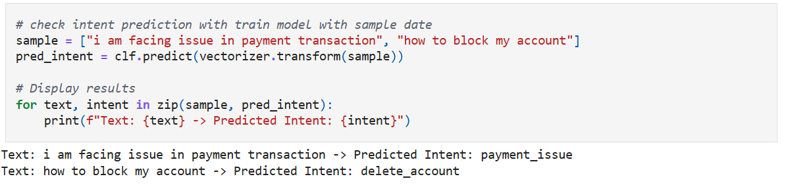

# 🧠 Customer Support Intent Classifier

NLP-based intent classification model for customer support queries using **TF-IDF** and **Logistic Regression**.

---

## 🎯 Major Goal of the Project

The main goal of this project is to **train an intent classification model** that automatically identifies the user’s intent from customer support queries such as:

> *cancel order*, *track order*, *payment issue*, *create account*, etc.

> 🧩 This version focuses purely on **machine learning and NLP model development**, without a web interface.

---

## 📘 Project Overview

This project uses the **Bitext Sample Customer Support Dataset (27K responses)** to train two classifiers:

- **Category Classifier** – Classifies the general topic of a user query  
- **Intent Classifier** – Identifies the specific intent behind the message

---

## 🗂️ Dataset

**Dataset name:**  
`Bitext_Sample_Customer_Support_Training_Dataset_27K_responses-v11.csv`

**Key Columns:**

| Column | Description | Example |
|--------|--------------|----------|
| `instruction` | User query | "I want to cancel my order" |
| `category` | Broader classification | `order_management` |
| `intent` | Specific intent label | `cancel_order`, `track_order` |
| `response` | Corresponding bot response | "Your order has been cancelled." |

---

## ⚙️ Workflow Steps

### **1. Data Preprocessing**
- Removed duplicates and nulls  
- Dropped unnecessary columns like `flags`  
- Cleaned text by:  
  - Lowercasing  
  - Removing URLs, special characters, and punctuation  

---

### **2. Feature Engineering**
- Used **TF-IDF Vectorization** to convert text into numerical form  

---

### **3. Model Training**
- Trained **Logistic Regression** models for both:  
  - Category prediction → `clf_cat`  
  - Intent prediction → `clf_intent`  

---

### **4. Model Evaluation**
- Used metrics such as:  
  - Accuracy  
  - Precision  
  - Recall  
  - F1-score  

---

### **5. Testing on Sample Inputs**
#### 📷 Example Output
_Here_ _is_ _the_ _sample_ _result_ _from_ _the_ _model_:

🧩 Tech Stack
> - _Python_ _🐍_
> - _Scikit-learn_
> - _Pandas / NumPy_
> - _NLTK / Regex_
> - _TF-IDF Vectorizer_

📅 Version: 1.0
🧾 License: MIT
